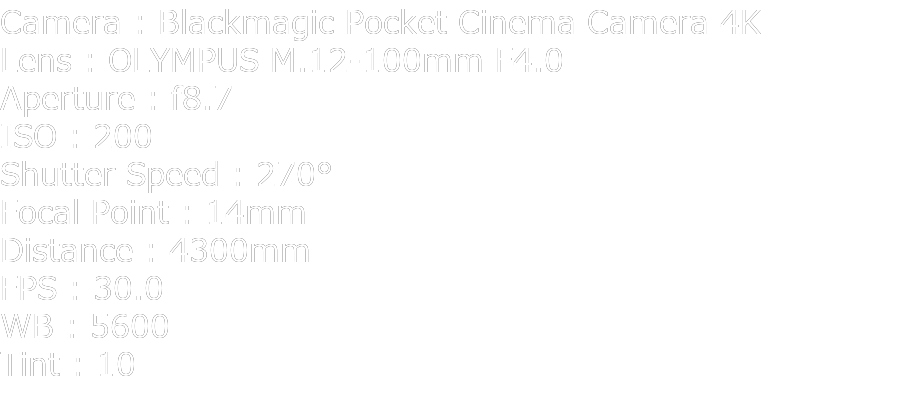

# DaVinci Resolve Python Scripts

## はじめに

Windows環境での使い方を記載。Macの場合は[こちら](https://note.com/littlebuddha/n/nf7325e8c16ea)参考にされると良いかもしれません。

DaVinci Resolve 17 Studioで動作確認しています。

## 注意事項

スクリプトの中にはデータの書き換えを行うものもあります。利用によってデータの消失がないとも言えません。利用する際には素材のバックアップをした上で行ってください。

## Pythonインストール

Python 3.6系を必ずインストール。3.10などでは動作しない。
なぜかGUIのインストーラーではDaVinci Resolveから認識されなくて、Chocolateyだとうまくいった。

PowerShellを管理者権限で起動して以下実行。

```
choco install -y python3
```

## 環境変数設定

以下のドキュメントに沿って環境変数を指定。

`C:\ProgramData\Blackmagic Design\DaVinci Resolve\Support\Developer\Scripting\README.txt`

ただし、PYTHONPATHについては絶対パスじゃない動作しなかったので以下のように設定した。

`%PYTHONPATH%;C:\ProgramData\Blackmagic Design\DaVinci Resolve\Support\Developer\Scripting\Modules`

つまりこれをWindowsの環境変数に入れる

```
RESOLVE_SCRIPT_API="%PROGRAMDATA%\Blackmagic Design\DaVinci Resolve\Support\Developer\Scripting"
RESOLVE_SCRIPT_LIB="C:\Program Files\Blackmagic Design\DaVinci Resolve\fusionscript.dll"
PYTHONPATH="%PYTHONPATH%;C:\ProgramData\Blackmagic Design\DaVinci Resolve\Support\Developer\Scripting\Modules"
```

PowerShellで以下のコマンドを入れてもよい

```powershell
[Environment]::SetEnvironmentVariable('RESOLVE_SCRIPT_API','%PROGRAMDATA%\Blackmagic Design\DaVinci Resolve\Support\Developer\Scripting', 'User')
[Environment]::SetEnvironmentVariable('RESOLVE_SCRIPT_LIB','C:\Program Files\Blackmagic Design\DaVinci Resolve\fusionscript.dll', 'User')
[Environment]::SetEnvironmentVariable('PYTHONPATH','%PYTHONPATH%;C:\ProgramData\Blackmagic Design\DaVinci Resolve\Support\Developer\Scripting\Modules', 'User')
```

## 作成したスクリプトの置き場

`C:\ProgramData\Blackmagic Design\DaVinci Resolve\Fusion\Scripts\`

このリポジトリはこのScripts配下を再現している。

## 環境設定の変更

`環境設定` > `システム` > `一般` > `一般環境設定` > `外部スクリプトに使用` を `ローカル` に変更

## スクリプトの実行

`ワークスペース` の `スクリプト` から実行可能

# Scripts

## colorful-clip

開いているビンのクリップに別々の色を付けてクリップを見分けやすくします

## offset-tc

クリップのタイムコードを一括でずらすスクリプト

### 注意

* 実行後は取消できないので注意が必要です
  * 元のTCに戻す場合はおそらくメディアプールに素材を再度投入し直す必要があります
* DaVinci Resolve 17.4.4のScripting APIではバグがあるようでSetClipPropertyでStart TCを指定した際に開始フレームではなく現在のフレームのタイムコードを変更してしまいます。各クリップの再生ヘッドを先頭に持ってこないと正しく処理されません。

### 使い方

* 動画が入っているビンに移動して実行すること
* ソースのvideoTcに動画のタイムコード、audioTcに音声のタイムコード、fpsにフレームレートを入れる
* 差分を計算し動画のタイムコードを音声のタイムコードに合うようにオフセットかけます

### 必要モジュール

```powershell
pip install timecode
```

## create-metag



動画のメタデータ情報の画像を生成する(現在BRAWのみ対応。)

### 注意事項

ビン内のクリップの拡張子をpngに変更した名前でファイルを「上書き」します。
ビン内にpngがあると上書される可能性があるので注意してください。

### 使い方

* 動画が入っているビンに移動して実行すること
* 画像が生成されるのでメディアプールに登録して利用する

####  Pythonモジュール
```powershell
pip install Pillow
```

## gh6-create-metag

試作 GH6向け create-metag
使い方は`create-metag`と同じです。

Exiftoolのインストールが必要になります。

#### Exiftoolインストール

```powershell
choco install exiftool
```

####  Pythonモジュール
```powershell
pip install Pillow
pip install pyexifinfo
```


## property-list

クリップのプロパティー名とメタデータ名を確認する為のスクリプト

↓結果。これが全てではない可能性はある

### プロパティー
```
{
  "Alpha mode": "None",
  "Angle": "",
  "Audio Bit Depth": "32",
  "Audio Ch": "2",
  "Audio Codec": "AAC",
  "Audio Offset": "",
  "Bit Depth": "8",
  "Camera #": "",
  "Clip Color": "",
  "Clip Name": "GX010184.MP4",
  "Comments": "",
  "Data Level": "Auto",
  "Date Added": "土 2月 5 2022 21: 47: 06",
  "Date Created": "土 2月 5 2022 13: 37: 18",
  "Date Modified": "Sat Feb  5 13: 37: 26 2022",
  "Description": "",
  "Drop frame": "0",
  "Duration": "00: 00: 06: 59",
  "Enable Deinterlacing": "0",
  "End": "418",
  "End TC": "13: 36: 36: 20",
  "FPS": 59.94,
  "Field Dominance": "Auto",
  "File Name": "GX010184.MP4",
  "File Path": "C:\\DaVinci Resolve\\folder\\GoPro\\GX010184.MP4",
  "Flags": "",
  "Format": "QuickTime",
  "Frames": "419",
  "Good Take": "",
  "H-FLIP": "オフ",
  "IDT": "",
  "In": "",
  "Input Color Space": "プロジェクト",
  "Input LUT": "",
  "Input Sizing Preset": "None",
  "Keyword": "",
  "Noise Reduction": "",
  "Offline Reference": "",
  "Out": "",
  "PAR": "Square",
  "Proxy": "None",
  "Proxy Media Path": "",
  "Reel Name": "",
  "Resolution": "3840x2160",
  "Roll/Card": "",
  "S3D Sync": "",
  "Sample Rate": "48000",
  "Scene": "",
  "Sharpness": "",
  "Shot": "",
  "Slate TC": "13: 36: 29: 21",
  "Start": "0",
  "Start KeyKode": "",
  "Start TC": "13: 36: 29: 21",
  "Synced Audio": "",
  "Take": "",
  "Type": "ビデオ + オーディオ",
  "Usage": "0",
  "V-FLIP": "オフ",
  "Video Codec": "H.265 Main L6.0",
  "Super Scale": 1
}
```
### メタデータ
```
{'Camera #': 'A',
'Camera Aperture': 'f10.0',
'Camera FPS': '30.000',
'Camera Firmware': '7.3',
'Camera ID': '07d7ff6c-2be9-40d6-b5e3-aa7b1e0cf463',
'Camera Manufacturer': 'Blackmagic Design',
'Camera Type': 'Blackmagic Pocket Cinema Camera 4K',
'Clip Number': 'A071_03270652_C013',
'Codec Bitrate': '252508080',
'Color Space Notes': 'Blackmagic Design',
'Compression Ratio': 'Q3',
'Date Recorded': '2022: 03: 27',
'Day / Night': 'day',
'Distance': '2925mm',
'Environment': 'exterior',
'Focal Point (mm)': '23mm',
'Gamma Notes': 'Blackmagic Design Film',
'Good Take': 'false',
'ISO': '800',
'LUT Used': 'Blackmagic Gen 5 Film to Extended Video.cube',
'Lens Type': 'OLYMPUS M.12-100mm F4.0',
'ND Filter': '0',
'Reel Number': '71',
'Scene': '1',
'Shot Type': 'WS',
'Shutter': '270°',
'Shutter Type': 'Angle',
'Take': '13',
'White Balance Tint': '10',
'White Point (Kelvin)': '5600'
}
```

## 参考

### GH6のメタデータ

```
{'SourceFile': 'E:/DaVinci Resolve Data/2022-04-02_?X?N???v?g?e?X?g/P1010025.MOV',
'ExifTool:ExifToolVersion': 12.4,
 'ExifTool:Warning': 'FileName encoding not specified',
 'File:Directory': 'E:/DaVinci Resolve Data/2022-04-02_?X?N???v?g?e?X?g',
 'File:FileAccessDate': '2022:04:02 20:36:17+09:00',
 'File:FileCreateDate': '2022:04:02 14:15:33+09:00',
 'File:FileModifyDate': '2022:04:02 14:08:07+09:00',
 'File:FileName': 'P1010025.MOV',
 'File:FilePermissions': '-rw-rw-rw-',
 'File:FileSize': '248 MiB',
 'File:FileType': 'MOV',
 'File:FileTypeExtension': 'mov',
 'File:MIMEType': 'video/quicktime',
 'File:ZoneIdentifier': 'Exists',
 'QuickTime:AudioBitsPerSample': 16,
 'QuickTime:AudioChannels': 3,
 'QuickTime:AudioFormat': 'lpcm',
 'QuickTime:AudioSampleRate': 1,
 'QuickTime:BackgroundColor': '0 0 0',
 'QuickTime:Balance': 0,
 'QuickTime:BitDepth': 24,
 'QuickTime:CompatibleBrands': ['qt  ',
 'pana'],
 'QuickTime:CompressorID': 'hvc1',
 'QuickTime:CreateDate': '2022:03:29 23:57:56',
 'QuickTime:CurrentTime': '0 s',
 'QuickTime:Duration': '7.01 s',
 'QuickTime:FontName': '',
 'QuickTime:GenBalance': 0,
 'QuickTime:GenFlags': '0 0 0',
 'QuickTime:GenGraphicsMode': 'ditherCopy',
 'QuickTime:GenMediaVersion': 0,
 'QuickTime:GenOpColor': '32768 32768 32768',
 'QuickTime:GraphicsMode': 'ditherCopy',
 'QuickTime:HandlerClass': 'Data Handler',
 'QuickTime:HandlerType': 'Metadata Tags',
 'QuickTime:ImageHeight': 2160,
 'QuickTime:ImageWidth': 3840,
 'QuickTime:MajorBrand': 'Apple QuickTime (.MOV/QT)',
 'QuickTime:MatrixStructure': '1 0 0 0 1 0 0 0 1',
 'QuickTime:MediaCreateDate': '2022:03:29 23:57:56',
 'QuickTime:MediaDataOffset': 2490880,
 'QuickTime:MediaDataSize': 257967538,
 'QuickTime:MediaDuration': '7.01 s',
 'QuickTime:MediaHeaderVersion': 0,
 'QuickTime:MediaLanguageCode': 'und',
 'QuickTime:MediaModifyDate': '2022:03:29 23:57:56',
 'QuickTime:MediaTimeScale': 120000,
 'QuickTime:MinorVersion': '2011.7.0',
 'QuickTime:ModifyDate': '2022:03:29 23:57:56',
 'QuickTime:MovieHeaderVersion': 0,
 'QuickTime:NextTrackID': 7,
 'QuickTime:OpColor': '32768 32768 32768',
 'QuickTime:OtherFormat': 'tmcd',
 'QuickTime:PanasonicSemi-ProMetadataXml': '
 <?xml version="1.0" encoding="UTF-8" standalone="no" ?>
<ClipMain xmlns:xsi="http://www.w3.org/2001/XMLSchema-instance"
    xmlns="urn:schemas-Professional-Plug-in:Semi-Pro:ClipMetadata:v1.0">
  <ClipContent>
    <GlobalClipID>1234567890ABCDEF1234567890ABCDEF1234567890ABCDEF1234567890ABCDEF</GlobalClipID>
    <Duration>840</Duration>
    <EditUnit>1001/120000</EditUnit>
    <EssenceList>
      <Video>
        <Codec BitRate="300">H265_420_LongGOP</Codec>
        <ActiveLine>2160</ActiveLine>
        <ActivePixel>3840</ActivePixel>
        <BitDepth>10</BitDepth>
        <FrameRate>119.88p</FrameRate>
        <TimecodeType>Drop</TimecodeType>
        <StartTimecode>00:02:39:03</StartTimecode>
      </Video>
      <Audio>
        <Channel>4</Channel>
        <SamplingRate>48000</SamplingRate>
        <BitsPerSample>24</BitsPerSample>
      </Audio>
    </EssenceList>
    <ClipMetadata>
      <Rating>0</Rating>
      <Access>
        <CreationDate>2022-03-30T08:57:56+09:00</CreationDate>
        <LastUpdateDate>2022-03-30T08:57:56+09:00</LastUpdateDate>
      </Access>
      <Device>
        <Manufacturer>Panasonic</Manufacturer>
        <ModelName>DC-GH6</ModelName>
      </Device>
      <Shoot>
        <StartDate>2022-03-30T08:57:56+09:00</StartDate>
      </Shoot>
    </ClipMetadata>
  </ClipContent>
  <UserArea>
    <AcquisitionMetadata xmlns="urn:schemas-Professional-Plug-in:P2:CameraMetadata:v1.2">
      <CameraUnitMetadata>
        <ISOSensitivity>250</ISOSensitivity>
        <WhiteBalanceColorTemperature>5600K</WhiteBalanceColorTemperature>
        <Gamma>
          <CaptureGamma>V-Log</CaptureGamma>
        </Gamma>
        <Gamut>
          <CaptureGamut>V-Gamut</CaptureGamut>
        </Gamut>
      </CameraUnitMetadata>
    </AcquisitionMetadata>
  </UserArea>
</ClipMain>
',
 'QuickTime:PanasonicSemi-ProMetadataXml-jpn-JP': '<?xml version="1.0" encoding="UTF-8" standalone="no" ?>
<ClipMain xmlns:xsi="http://www.w3.org/2001/XMLSchema-instance"
xmlns="urn:schemas-Professional-Plug-in:Semi-Pro:ClipMetadata:v1.0">
  <ClipContent>
    <GlobalClipID>1234567890ABCDEF1234567890ABCDEF1234567890ABCDEF1234567890ABCDEF</GlobalClipID>
    <Duration>840</Duration>
    <EditUnit>1001/120000</EditUnit>
    <EssenceList>
      <Video>
        <Codec BitRate="300">H265_420_LongGOP</Codec>
        <ActiveLine>2160</ActiveLine>
        <ActivePixel>3840</ActivePixel>
        <BitDepth>10</BitDepth>
        <FrameRate>119.88p</FrameRate>
        <TimecodeType>Drop</TimecodeType>
        <StartTimecode>00:02:39:03</StartTimecode>
      </Video>
      <Audio>
        <Channel>4</Channel>
        <SamplingRate>48000</SamplingRate>
        <BitsPerSample>24</BitsPerSample>
      </Audio>
    </EssenceList>
    <ClipMetadata>
      <Rating>0</Rating>
      <Access>
        <CreationDate>2022-03-30T08:57:56+09:00</CreationDate>
        <LastUpdateDate>2022-03-30T08:57:56+09:00</LastUpdateDate>
      </Access>
      <Device>
        <Manufacturer>Panasonic</Manufacturer>
        <ModelName>DC-GH6</ModelName>
      </Device>
      <Shoot>
        <StartDate>2022-03-30T08:57:56+09:00</StartDate>
      </Shoot>
    </ClipMetadata>
  </ClipContent>
  <UserArea>
    <AcquisitionMetadata xmlns="urn:schemas-Professional-Plug-in:P2:CameraMetadata:v1.2">
      <CameraUnitMetadata>
        <ISOSensitivity>250</ISOSensitivity>
        <WhiteBalanceColorTemperature>5600K</WhiteBalanceColorTemperature>
        <Gamma>
          <CaptureGamma>V-Log</CaptureGamma>
        </Gamma>
        <Gamut>
          <CaptureGamut>V-Gamut</CaptureGamut>
        </Gamut>
      </CameraUnitMetadata>
    </AcquisitionMetadata>
  </UserArea>
</ClipMain>
',
 'QuickTime:PosterTime': '0 s',
 'QuickTime:PreferredRate': 1,
 'QuickTime:PreferredVolume': '100.00%',
 'QuickTime:PreviewDuration': '0 s',
 'QuickTime:PreviewTime': '0 s',
 'QuickTime:SelectionDuration': '0 s',
 'QuickTime:SelectionTime': '0 s',
 'QuickTime:SourceImageHeight': 2160,
 'QuickTime:SourceImageWidth': 3840,
 'QuickTime:TextColor': '0 0 0',
 'QuickTime:TextFace': 'Plain',
 'QuickTime:TextFont': 'System',
 'QuickTime:TextSize': 12,
 'QuickTime:TimeCode': 6,
 'QuickTime:TimeScale': 120000,
 'QuickTime:TrackCreateDate': '2022:03:29 22:22:22',
 'QuickTime:TrackDuration': '7.01 s',
 'QuickTime:TrackHeaderVersion': 0,
 'QuickTime:TrackID': 1,
 'QuickTime:TrackLayer': 0,
 'QuickTime:TrackModifyDate': '2022:03:29 22:22:22',
 'QuickTime:TrackVolume': '0.00%',
 'QuickTime:VideoFrameRate': 119.88,
 'QuickTime:XResolution': 72,
 'QuickTime:YResolution': 72,
 'MakerNotes:Model': 'DC-GH6',
 'Composite:AvgBitrate': '295 Mbps',
 'Composite:ImageSize': '3840x2160',
 'Composite:Megapixels': 8.3,
 'Composite:Rotation': 0}
```
